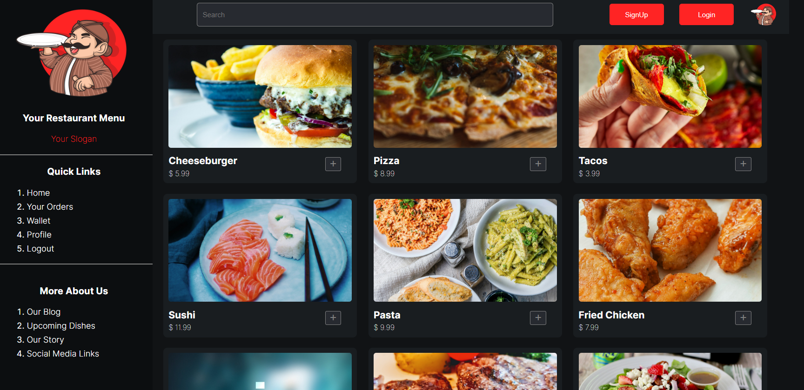

A real life website for a restaurant.

Mainly 5 tasks are done when you go in a restaurant. You get the menu and then Someone takes your order. Then your order is given to the chef and the chef starts preparing it. Once food is cooked, the food is given to the waiter and the waiter gives the food to you. then you eat it and pay for it.

First function - getMenu() -> On the load of the screen run this function and In this function, call using fetch to get the food items from the JSON and show them to a user.

TakeOrder() - This function is returning a promise and taking 2500 milliseconds to resolve the order. 

orderPrep() - This function also returns a promise and takes 1500 milliseconds to resolve.

payOrder() - This function also returns a promise in 1000 milliseconds to reolve and the resolve returns the object {order_status:true; paid:true}

thankyouFnc() - Once {paid:true} is received, an alert on the screen saying thankyou for eating with us today!